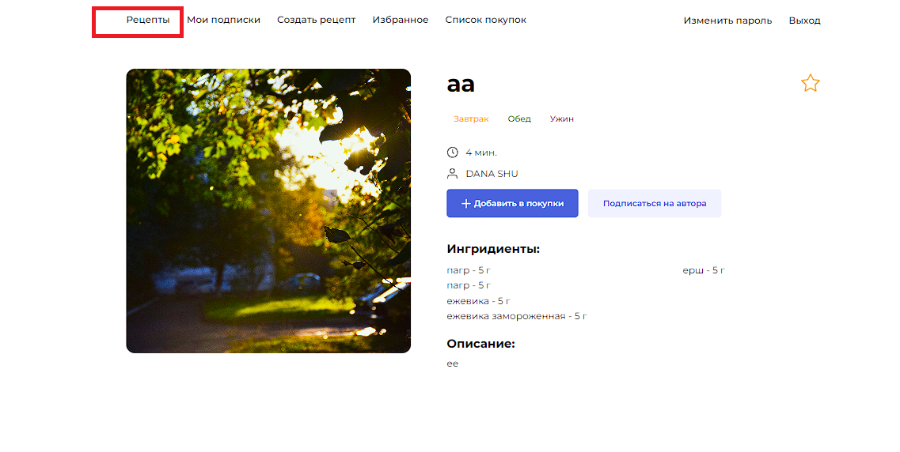

## Функциональные баги
**ID**:A1PV-128  

**Всплывающее окно закрывается при тапе на любую зону** 

**Шаги воспроизведения:**
1. Отключить интернет
2. Открыть мобильное приложение
3. Тапнуть по любой активной кнопке на экране
4. Нажать на любую зону, кроме кнопки "OK" 

**Ожидаемый результат:** всплывающее окно не закрылось  
**Фактический результат:**  всплывающее окно закрылось  

**Окружение:** 
Эмулятор Android Studio, OS: Android 9.0

**Приоритет:** 
Серьезный

## Визуальные баги

**ID**:DPQAT3-6  

**Цвет текста "Рецепты" черного цвета - #000000** 

**Предусловия:** 
1. Пройти авторизацию  

**Шаги воспроизведения:**
1. Нажать на вкладку "рецепты" в шапке профиля 
2. Нажать на название рецепта 

**Ожидаемый результат:** Цвет текста "Рецепты" синего цвета - #4A61DD; 
**Фактический результат:** Цвет текста "Рецепты" черного цвета - #000000 

**Окружение:** 
1. Операционная система: Windows 11, Браузер: Google Chrome 122.0.6261.129, разрешение экрана: 1920х1080
2. Операционная система: Windows 11, Браузер: Google Chrome 122.0.6261.129, разрешение экрана: 412x892
3. Операционная система: Mozilla Firefox 121.0.1, разрешение экрана: 1920х1080

**Приоритет** 
Незначительный

## Логические баги

**ID**:DPQAT3-75  

**Не появилось всплывающее сообщение об ошибке** 

**Предусловия:** 
1. Пройти авторизацию  

**Шаги воспроизведения:**
1. Нажать на вкладку "Создать рецепт" в шапке профиля
2. Заполнить поле "Название рецепта": "К"
3. Выбрать ингредиент: " Молоко"
4. В поле количества ввести: "1.2"
5. Нажать на кнопку "Добавить ингредиент"
6. В поле " Описание рецепта" ввести: "А"
7. Нажать на кнопку выбрать файл
8. Добавить файл формата JPG
9. Нажать на кнопку "Создать рецепт"

**Ожидаемый результат:** Появилось всплывающее сообщение об ошибке, включающее пояснение ко всем неверно заполненным полям, если данные введены неккоректно 
**Фактический результат:** Не появилось всплывающее сообщение об ошибке 

**Окружение:** 
1. Операционная система: Windows 11, Браузер: Google Chrome 122.0.6261.129, разрешение экрана: 1920х1080
2. Операционная система: Windows 11, Браузер: Google Chrome 122.0.6261.129, разрешение экрана: 412x892
3. Операционная система: Mozilla Firefox 121.0.1, разрешение экрана: 1920х1080

**Приоритет** 
Средний

